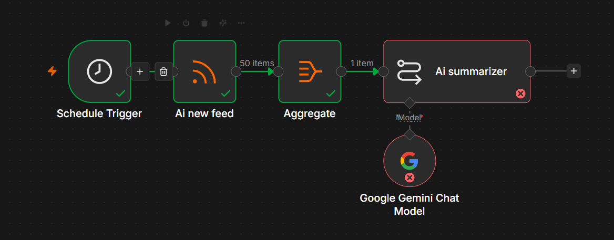
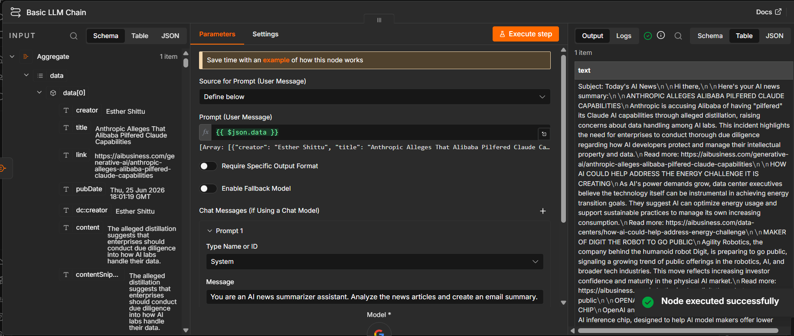
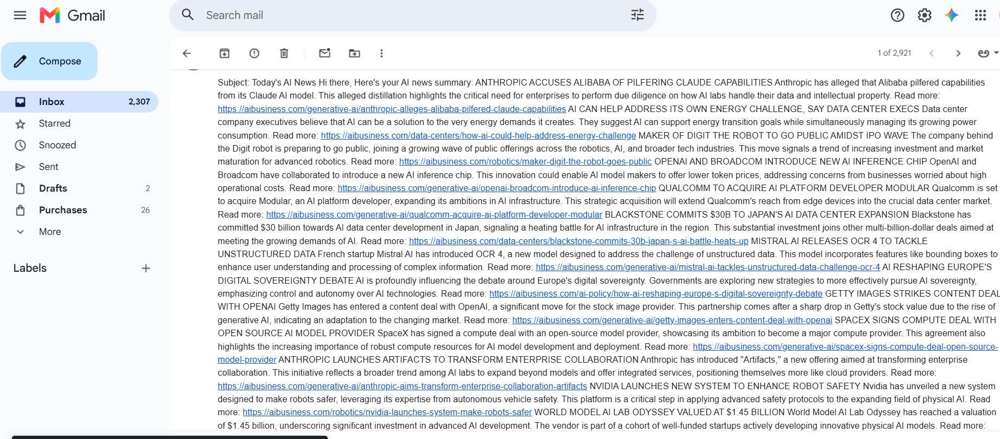

# AI News Automation using n8n

## Overview

This project automates the process of collecting the latest Artificial Intelligence news from an RSS feed, summarizes it using Google's Gemini AI model, and sends a well-formatted email every day using Gmail.

## Features

-  Daily scheduled execution
-  Fetches AI news from RSS feeds
-  AI-powered news summarization using Gemini
-  Automatically sends email summaries
-  Fully automated workflow using n8n

## Workflow

```
Schedule Trigger
        ↓
Read RSS Feed
        ↓
Aggregate Articles
        ↓
Gemini AI Summary
        ↓
Send Email
```

## Technologies Used

- n8n
- Google Gemini 2.5 Flash
- Gmail
- RSS Feed
- AI Automation

## How to Use

1. Install n8n.
2. Import the workflow JSON file.
3. Configure your Gemini API credentials.
4. Configure Gmail OAuth credentials.
5. Activate the workflow.

## Project Screenshots

### Workflow



### Execution



### Email Output



## Repository Contents

- `ai news workflow using n8n.json` – n8n workflow
- `README.md` – Project documentation
- `LICENSE` – MIT License

## Author

**Manasa**

